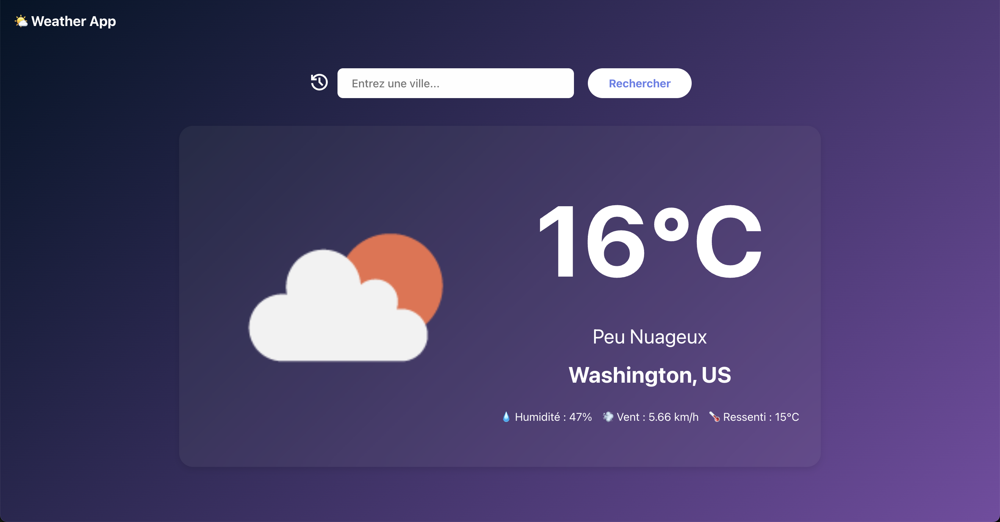

# 🌤️ Weather App - React

Application météo moderne permettant de rechercher et d'afficher la météo de n'importe quelle ville dans le monde.



## ✨ Fonctionnalités

- 🔍 Recherche de ville par nom
- 🌡️ Affichage détaillé : température, description, icône météo
- 💨 Informations complémentaires : humidité, vent, température ressentie
- 📜 Historique des recherches récentes (modal)
- 💾 Persistance des données avec localStorage
- 📱 Design responsive (mobile, tablette, desktop)
- 🎨 Interface moderne avec glassmorphism

## 🚀 Démo

[Lien vers la démo live](#) <!-- À ajouter après déploiement Vercel -->

## 🛠️ Technologies utilisées

- **React 19** - Bibliothèque UI
- **Vite** - Build tool
- **OpenWeatherMap API** - Données météorologiques
- **Geocoding API** - Conversion ville → coordonnées
- **localStorage** - Persistance de l'historique
- **CSS3** - Animations et glassmorphism

## 📦 Installation

### Prérequis
- Node.js 16+
- Compte OpenWeatherMap (gratuit) pour obtenir une clé API

### Étapes

1. Cloner le repository
```bash
git clone https://github.com/ton-username/weather-app-react.git
cd weather-app-react
```

2. Installer les dépendances
```bash
npm install
```

3. Créer un fichier `.env` à la racine
```bash
VITE_WEATHER_API_KEY=votre_clé_api_ici
```

4. Lancer le serveur de développement
```bash
npm run dev
```

## 🎯 Concepts React mis en pratique

- **Hooks** : useState, useEffect
- **API externes** : fetch, gestion asynchrone
- **Composants réutilisables** : CityForm, WeatherCard, Modal
- **Gestion d'état** : loading, error, data
- **localStorage** : persistance côté client
- **Conditional rendering** : affichage conditionnel selon l'état
- **Variables d'environnement** : protection de la clé API

<!--
## Améliorations possibles

- [ ] Mode sombre / clair
- [ ] Catégories / tags pour les tâches
- [ ] Date d'échéance et rappels
- [ ] Backend avec API REST
- [ ] Authentification utilisateur
- [ ] Tests unitaires et d'intégration -->

## 👨‍💻 Auteur

**Yann** - Développeur Front-End  
[LinkedIn](https://www.linkedin.com/in/yann-grillon/) <!-- | [Portfolio](#) -->

<!--
## 📄 Licence

Ce projet est open source et disponible sous [licence MIT](LICENSE).
-->
---

⭐ N'hésitez pas à star le projet si vous l'avez trouvé utile !ce et disponible sous [licence MIT](LICENSE).